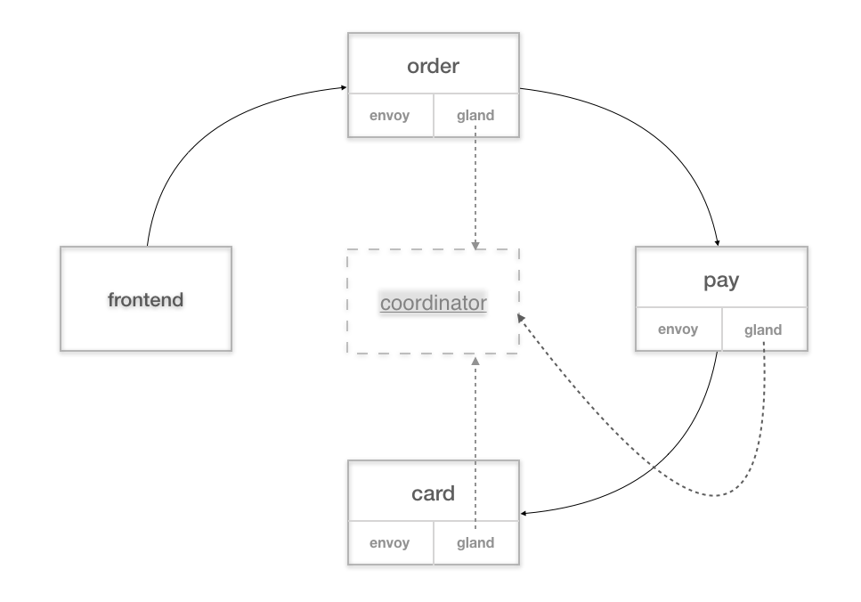
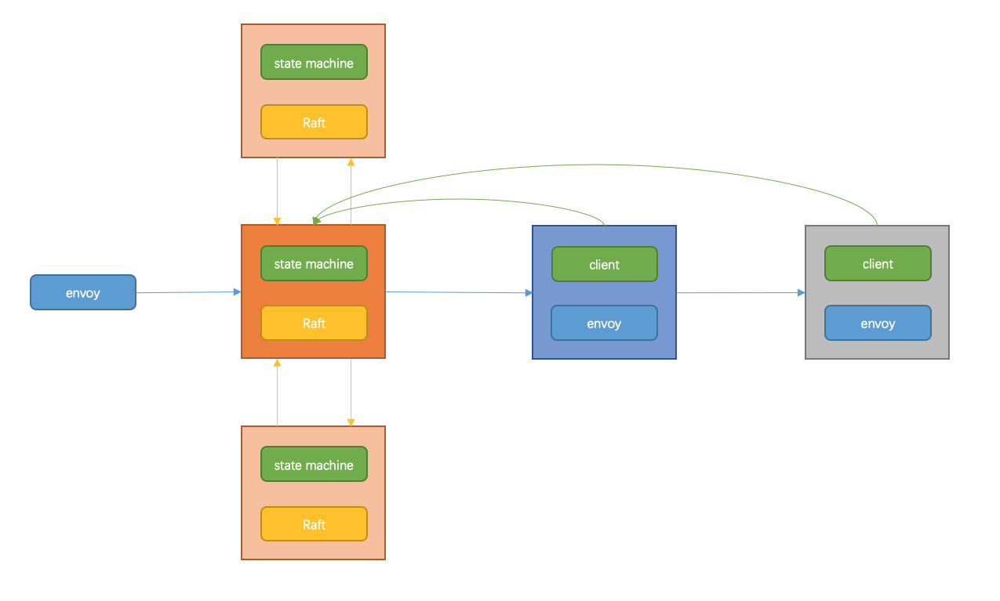
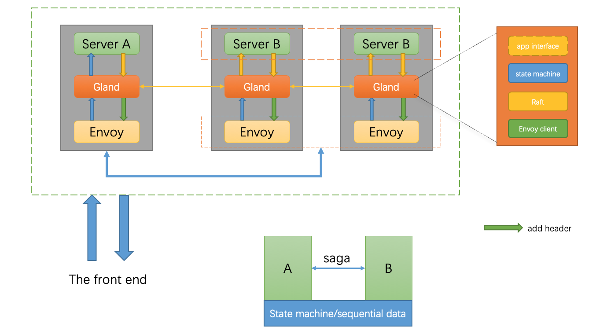

## Gland(designing)

###### A sidecar provides distributed transactions across languages and write in the golang.

### design

### see again

+ [Implementing leader election in Kubernetes](https://kubernetes.io/blog/2016/01/simple-leader-election-with-kubernetes/)

